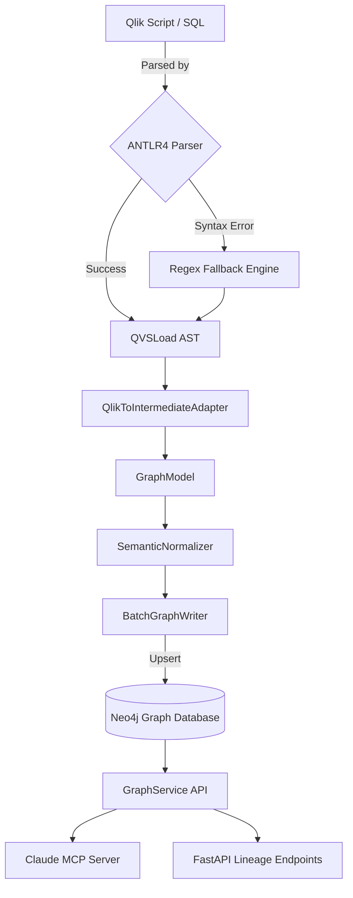

# Metadata Lineage Engine - Features & Guarantees

This document outlines the core capabilities of the Metadata Lineage Engine (Phase 12). 

Unlike standard lineage extractors, this engine prioritizes **enterprise governance guarantees**, **temporal correctness**, and **observability**.

## Architecture Overview

## 1. Enterprise Governance Guarantees
- **Temporal Snapshotting**: The graph stores time-bound relationships (`valid_from`, `valid_to`). Users can reconstruct exact historical lineage states using `SnapshotContext`.
- **Graph Compaction**: Incremental refresh safely retires old lineage relationships. A simulated cold-archive JSON export handles graph compaction for relationships older than 90 days.
- **Deterministic Hashing**: Node and process IDs are generated deterministically via SHA-256 (canonical strings), guaranteeing idempotent graph idempotency across distributed environments.

## 2. Advanced Parser Correctness
- **ANTLR4 Grammar Support**: Core QlikView scripting (SET, SQL SELECT, LOAD, RESIDENT) is parsed using a formal ANTLR grammar, significantly reducing AST hallucinations compared to regex-only extraction.
- **Fallback Resilience Engine**: If the ANTLR grammar encounters an unhandled syntax edge case, the platform automatically falls back to an emergency Regex parser.
- **Corpus & Fuzzing Validation**: Rigorous unit testing includes random syntax mutation fuzzing (1,000 iterations for CI) and strict JSON structure regressions for semantic "Gold Standards."

## 3. Semantic Normalization & Ontology
- **Intermediate Adapter**: Transforms messy parser-specific ASTs (`QlikViewApp`, `QVSLoad`) into a unified `GraphModel`.
- **Semantic Normalizer**: Deduplicates tables, standardizes casing, handles partial lineage (unresolved SQL `SELECT *`), and merges fragmented data assets into a cohesive logical layer.

## 4. Incremental Change Awareness
- **Composite Hash Detection**: Before parsing, the engine hashes the script content, dependencies, and parser version. If no structural changes occurred, the expensive graph regeneration is bypassed entirely (`O(1)` skipping).
- **Temporal Edge Expiration**: If a script *did* change, the system expires the old subgraph temporally (setting `is_active=false`) rather than deleting it.

## 5. Operational Telemetry & MCP
- **Prometheus Observability**: Native tracking of parser fallback rates, AST mutation counts, parse latencies, and total graph node operations. Available at `/metrics`.
- **Model Context Protocol (MCP)**: Native Claude Desktop integration exposing tools (`search_tables`, `get_table_lineage`, `get_dashboard_metrics`, `get_script_subroutines`) to AI agents, backed by a clean `GraphService` abstraction.
- **Structured JSON Logging**: Every sub-component emits deterministic `structlog` events for enterprise log aggregation (ELK/Splunk).
