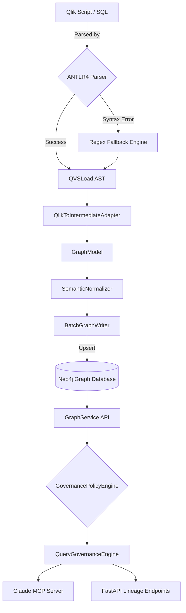

# Metadata Lineage Engine - Features & Guarantees

This document outlines the core capabilities of the Metadata Lineage Engine (Phase 14). 

Unlike standard lineage extractors, this engine prioritizes **enterprise governance guarantees**, **temporal correctness**, **federated policy enforcement**, and **observability**.

## Architecture Overview

## 1. Federated Governance & Metadata Isolation
- **Domain Namespaces**: Graph entities possess `namespace_id`, `trust_zone`, and `governance_scope` attributes. Edge traversals that cross organizational domains invoke cross-domain authorization policies.
- **Dynamic Policy Enforcement**: The `GovernancePolicyEngine` centrally enforces `ALLOW`, `DENY`, `MASK`, and `REDACT` semantics. It operates as an interceptor before data is hashed or serialized, guaranteeing strict isolation and eliminating metadata leakage.
- **Stewardship Boundaries**: Organizational accountability is linked to namespaces, resolving technical ownership, escalation protocols, and audit compliance scopes via the `StewardshipManager`.
- **Workload Orchestration**: Heavy operations like point-in-time replays or distributed graph integrity scans are queued through an asynchronous, priority-tiered `WorkloadManager`, eliminating synchronous resource starvation.

## 2. Enterprise Trust Guarantees
- **Temporal Snapshotting & Replay**: The graph stores time-bound relationships (`valid_from`, `valid_to`). Users can reconstruct exact historical lineage states using the `ReplayEngine` and generate immutable snapshot manifests.
- **Query Governance Engine**: Direct Cypher access is blocked. All queries are intercepted to enforce traversal budgets, calculate maximum node fanout cost, and ensure temporal safety.
- **Graph Compaction & Integrity**: Incremental refresh safely retires old lineage relationships. The `GraphIntegrityVerifier` natively detects orphans, cyclic loops, and temporal window overlaps across the database.
- **Deterministic Hashing**: Node and process IDs are generated deterministically via SHA-256 (canonical strings), guaranteeing graph idempotency across distributed environments.

## 3. Advanced Parser Correctness
- **ANTLR4 Grammar Support**: Core QlikView scripting (SET, SQL SELECT, LOAD, RESIDENT) is parsed using a formal ANTLR grammar, significantly reducing AST hallucinations compared to regex-only extraction.
- **Structured Parser Recovery**: The `ParserRecoveryEngine` tracks execution provenance, degrading gracefully through `TOKEN_RECOVERY`, `PARTIAL_BLOCK_RECOVERY`, or `REGEX_FALLBACK`, actively tracking what was salvaged vs inferred.
- **Trust Propagation Engine**: The graph algorithmically propagates confidence degradation along edges. Low-confidence upstream transformations dynamically penalize the overall `TrustEvaluation` of downstream analytics.
- **Governance Drift Intelligence**: Lineage structure shifts are quantified mathematically. The platform tracks mutation trajectories (schema drift vs semantic drift vs trust drift) over time.

## 4. Semantic Normalization & Ontology
- **Intermediate Adapter**: Transforms messy parser-specific ASTs (`QlikViewApp`, `QVSLoad`) into a unified `GraphModel`.
- **Semantic Normalizer**: Deduplicates tables, standardizes casing, handles partial lineage (unresolved SQL `SELECT *`), and merges fragmented data assets into a cohesive logical layer.

## 5. Incremental Change Awareness
- **Composite Hash Detection**: Before parsing, the engine hashes the script content, dependencies, and parser version. If no structural changes occurred, the expensive graph regeneration is bypassed entirely (`O(1)` skipping).
- **Temporal Edge Expiration**: If a script *did* change, the system expires the old subgraph temporally (setting `is_active=false`) rather than deleting it.

## 6. Operational Telemetry & MCP
- **Prometheus Observability**: Native tracking of parser fallback rates, AST mutation counts, parse latencies, and total graph node operations. Available at `/metrics`.
- **Model Context Protocol (MCP)**: Native Claude Desktop integration exposing tools (`search_tables`, `get_table_lineage`, `get_dashboard_metrics`, `get_script_subroutines`) to AI agents, backed by a clean `GraphService` abstraction.
- **Structured JSON Logging**: Every sub-component emits deterministic `structlog` events for enterprise log aggregation (ELK/Splunk).
